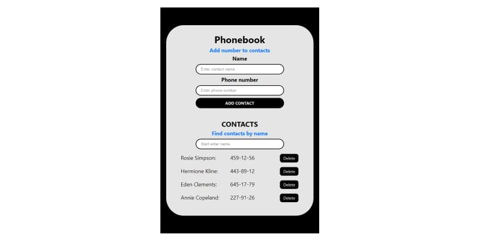

## Критерії приймання ДЗ
- Створений репозиторій: `goit-react-hw-06-phonebook`
- При здачі домашньої роботи є посилання: на вихідні файли та робочу сторінку проекту на `GitHub Pages`
- В Redux-стані зберігається мінімально необхідний набір даних
- Під час запуску коду завдання в консолі відсутні помилки та попередження.
- Для кожного компонента є окрема папка з файлом React-компонента та файлом стилів
- Для компонентів описані `propTypes`
- Використана бібліотека `Redux Toolkit`
- Використаний цей
[шаблон React-проекту](https://github.com/goitacademy/react-homework-template#readme)
як стартова точка програми.

## Завдання «Книга контактів» (Redux Toolkit)
Виконай рефакторинг коду застосунку [«Книга контактів»](https://github.com/Tasitaforme/goit-react-hw-04-phonebook), додавши управління станом за допомогою бібліотеки [Redux Toolkit](https://redux-toolkit.js.org/). Нехай Redux-стан виглядає наступним чином.

```
    {
    contacts: [],
    filter: ""
    }
```

- Створи сховище з `configureStore()`
- Використовуй функцію `createSlice()`
- Створи дії збереження та видалення контакту, а також оновлення фільтра
- Зв'яжи React-компоненти з Redux-логікою за допомогою хуків бібліотеки [react-redux](https://react-redux.js.org/).
- Використай бібліотеку Redux Persist для збереження масиву контактів у локальному сховищі

# Бібліотеки та імпорти

## Бібліотека Redux Toolkit
[npm install @reduxjs/toolkit](https://redux-toolkit.js.org/introduction/getting-started)

`npm install react-redux`

Якщо не буде використовуватись функція `combineReducers()` то можна 2 в 1:

`npm install @reduxjs/toolkit react-redux`


### Зв'язування store з компонентами React
```js
import { Provider } from 'react-redux';
import { store } from "./redux/store";

ReactDOM.createRoot(document.getElementById('root')).render(
  <Provider store={store}>
    <React.StrictMode>
      <App />
    </React.StrictMode>
  </Provider>
);
```
### Підписка на store - хук useSelector(selector)
```js
import { useSelector } from "react-redux";

const App = () => {
  // Отримуємо необхідну частину state
  const contacts = useSelector(state => state.contacts);
};
```
### Відправка actions - хук useDispatch()

```js
import { useDispatch } from "react-redux";

const App = () => {
  // Отримуємо посилання на функцію actions
  const dispatch = useDispatch();

  dispatch(deleteСontact(id));
};
```

### Генератор унікальних ідентифікаторів рядків для JS (в Redux Toolkit)

```js
import { nanoid } from '@reduxjs/toolkit';

id: nanoid()
```

## Робота з localStorage в Redux
[**npm i redux-persist**](https://www.npmjs.com/package/redux-persist)

```js
// index.js
import { PersistGate } from 'redux-persist/integration/react'

const App = () => {
  return (
    <Provider store={store}>
      <PersistGate loading={null} persistor={persistor}>
        <RootComponent />
      </PersistGate>
    </Provider>
  );
};
```

```js
// store.js
import { combineReducers, configureStore } from '@reduxjs/toolkit';
import { persistStore, persistReducer } from 'redux-persist'
import storage from 'redux-persist/lib/storage' // defaults to localStorage 
 
const persistConfig = {
  key: 'root',
  storage,
  whitelist: ['contacts']
};

const reducer = combineReducers({
  contacts: contactsReducer,
  filter: filterReducer,
});

const persistedReducer = persistReducer(persistConfig, reducer);

export const store = configureStore({
  reducer: persistedReducer,
});

export const persistor = persistStore(store);
```
**Iгнорування всіх типів дій, які надсилає Redux-Persist і видає помилки в консолі**

[Use with Redux-Persist](https://redux-toolkit.js.org/usage/usage-guide#use-with-redux-persist)

```js
// store.js
import {
  persistStore,
  persistReducer,
  FLUSH,
  REHYDRATE,
  PAUSE,
  PERSIST,
  PURGE,
  REGISTER,
} from 'redux-persist'

const store = configureStore({
  reducer: persistedReducer,
  middleware: (getDefaultMiddleware) =>
    getDefaultMiddleware({
      serializableCheck: {
        ignoredActions: [FLUSH, REHYDRATE, PAUSE, PERSIST, PURGE, REGISTER],
      },
    }),
})
```

## Перевірка типів одержуваних пропсів
[**npm i prop-types**](https://www.npmjs.com/package/prop-types)

```js
import PropTypes from 'prop-types'

MovieDetails.propTypes = {
  movie: PropTypes.shape({
    title: PropTypes.string.isRequired,
    vote: PropTypes.number.isRequired,
    genres: PropTypes.arrayOf(
      PropTypes.shape({
        name: PropTypes.string.isRequired,
      }).isRequired
    ).isRequired,
    overview: PropTypes.string.isRequired,
  }).isRequired,
};
```
<!-- ## Генератор унікальних ідентифікаторів рядків для JS
[**npm i nanoid**](https://www.npmjs.com/package/nanoid)

`import { nanoid } from 'nanoid'`

`id: nanoid()` -->

## Cповіщення для React [react-hot-toast](https://react-hot-toast.com/docs)
[**npm i react-hot-toast**](https://www.npmjs.com/package/react-hot-toast)

```js
import toast, { Toaster } from 'react-hot-toast';

const notify = () => toast.success('Here is your toast!', {
        duration: 1500,
      })

const App = () => {
  return (
    <div>
      <button onClick={notify}>Make me a toast</button>
      <Toaster />
    </div>
  );
};
```

## CSS на JavaScript
[**npm i styled-components**](https://www.npmjs.com/package/styled-components)

```js
import styled from 'styled-components';

export const Button = styled.button`
background-color: black;
transition: background-color 250ms ease-in-out;

&:hover {
    background-color: #007aff;
  }
`;
```